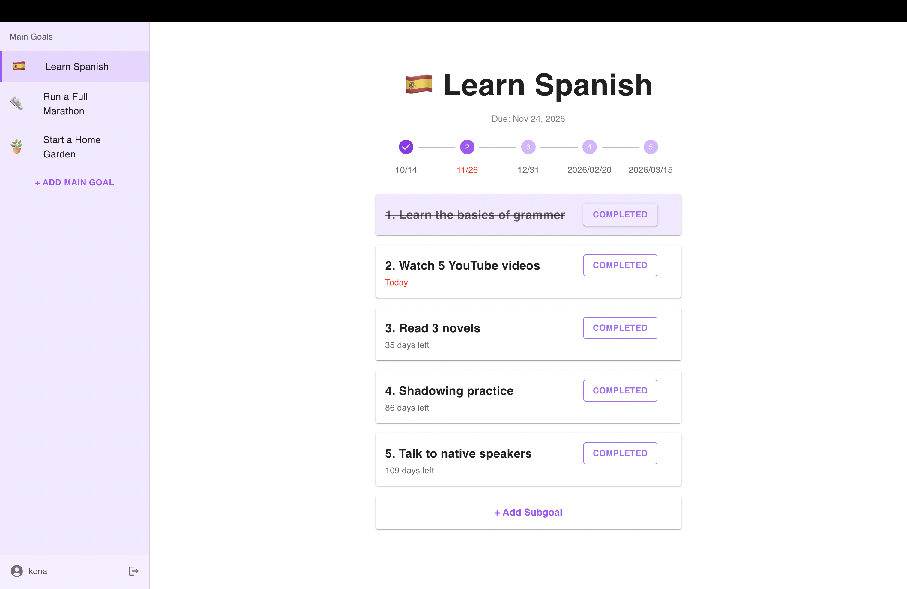

# Goals Tracker

### A goal-tracking project written in JavaScript that helps users break big objectives into smaller steps and monitor their progress through an intuitive interface.

## Live Demo

[https://goals-tracker-one.vercel.app/](https://goals-tracker-one.vercel.app/)

## UI Example


## Features
- Create main goals with due dates and custom icon
- Add sub-goals under each main goal to break work into smaller steps
- Track progress automatically based on completed sub-goals
- Sidebar navigation for switching between major goals

## Tech Stack
- **Frontend:** React, Material UI
- **Backend:** Node.js, Express
- **Database:** MongoDB + Mongoose
- **Other:** REST API structure, JSON handling

## Project Structure
```text
    client/
      src/
        assets/
        components/
        App.jsx
        main.jsx

    server/
      routes/
      models/
      server.js
```

## API Endpoints
### Auth
- `POST /auth/signup` - create an account
- `POST /auth/login` - login and receive a token
### Main Goals
- `GET /mainGoals` — fetch all main goals
- `POST /mainGoals` — create a main goal
- `PUT /mainGoals/:id` — update a main goal
- `DELETE /mainGoals/:id` — delete a main goal
### Subgoals
- `POST /mainGoals/:mainGoalId/subgoals` — create a subgoal
- `PUT /subgoals/:id` — update a subgoal
- `PATCH /subgoals/:id` — toggle a subgoal’s completion status
- `DELETE /subgoals/:id` — delete a subgoal

## Local Setup (Coming Soon)
Instructions for running the client and server locally will be added soon.

## Deployment Status
The application is fully deployed and available online.
- **Frontend:** Vercel
- **Backend:** Render
- **Database:** MongoDB Atlas

You can access the live version here:
[Live Demo](#live-demo)

## Future Improvements
- Add a horizontal calendar view that displays all main goals

## License
This project is licensed under the MIT License.
